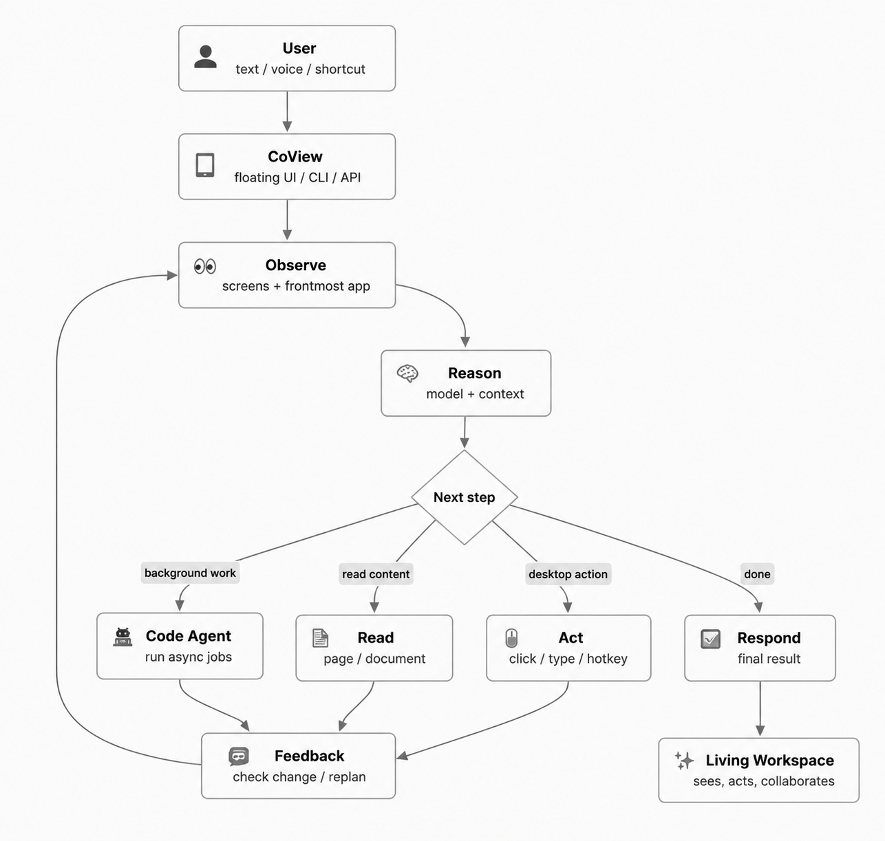
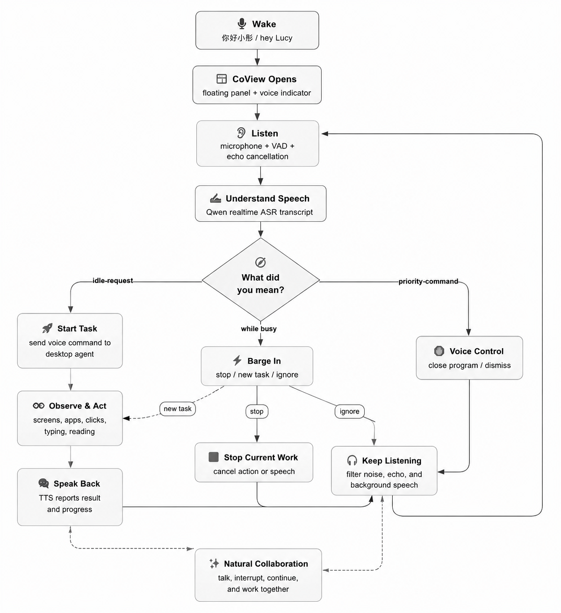

<h1 align="center">CoView - Desktop AI Companion</h1>

<p align="center">
  <a href="README.zh-CN.md">中文文档</a> ·
  <a href="docs/en/README.md">Full Documentation</a>
</p>

<p align="center">
  
</p>

<p align="center">
  <a href="https://github.com/mini-yifan/CoView"></a>
  
  
  <a href="LICENSE"></a>
</p>

<p align="center">
  A desktop AI companion that sees, acts, and collaborates, turning your computer into a living workspace.
</p>

---

## Why CoView

CoView is built for a simple idea: your computer should not just wait for commands. It should see what you see, understand what you are trying to do, and work with you across the apps already on your screen.

At its core, CoView is powered by a local visual control loop:

```text
Observe screen -> reason about the task -> execute one action -> observe again
```

That means CoView is not limited to chat. It can operate browsers, editors, documents, websites, desktop apps, and coding workspaces through mouse, keyboard, voice, and background Code Agent workflows.

## Highlights

| Capability                   | What CoView Does                                                                                                   |
| ---------------------------- | ------------------------------------------------------------------------------------------------------------------ |
| 👀 See                       | Observes your desktop through screenshots and visual reasoning.                                                    |
| 🖥️ Multi-Screen Control    | Understand and manipulate windows and content across multiple monitors, and quickly perform GUI operations.        |
| 🖱️ Act                     | Clicks, drags, scrolls, uses hotkeys, inputs text, and reads pages or documents.                                   |
| 🤝 Collaborate               | Works from a floating assistant UI with task input, stop control, logs, settings, and suggestions.                 |
| 🎙️ Listen & Respond        | Supports ASR, TTS, local wake-word detection, and voice indicators.                                                |
| 🧑‍💻 Background Code Agent | Run codes and automated tasks asynchronously in the background, supporting Codex, Claude Code, Kimi Code and more. |
| 🌐 Chinese & English         | Provides bilingual product flows and documentation.                                                                |
| 🔌 Model Flexible            | Uses OpenAI-compatible endpoints through `base_url`, `api_key`, and `model_name`.                            |

## How CoView Works

<p align="center">
  
</p>

## Voice Interaction

<p align="center">
  
</p>

Default wake words: `你好小彤` and `hey Lucy`.

## Quick Start

Requirements:

- Python 3.10 or newer. Python 3.11/3.12 are recommended.
- macOS or Windows.
- A visual model endpoint compatible with the OpenAI-style API shape used by this project.

### 1. Clone the Repository

| macOS / Linux                                          | Windows PowerShell                                     |
| ------------------------------------------------------ | ------------------------------------------------------ |
| `git clone https://github.com/mini-yifan/CoView.git` | `git clone https://github.com/mini-yifan/CoView.git` |
| `cd CoView`                                          | `cd CoView`                                          |

### 2. Create and Activate a Virtual Environment

| macOS / Linux                 | Windows PowerShell             |
| ----------------------------- | ------------------------------ |
| `python3 -m venv .venv`     | `py -3 -m venv .venv`        |
| `source .venv/bin/activate` | `.venv\Scripts\Activate.ps1` |

If PowerShell blocks activation, run this once in the same PowerShell window:

```powershell
Set-ExecutionPolicy -Scope Process -ExecutionPolicy Bypass
```

### 3. Install CoView

| macOS                                              | Windows                                 |
| -------------------------------------------------- | --------------------------------------- |
| `python3 -m pip install -U pip`                  | `py -m pip install -U pip`            |
| `python3 -m pip install -e ".[macos,voice,tts]"` | `py -m pip install -e ".[voice,tts]"` |

### 4. Configure Your Model

CoView reads `config.json` from the repository root and merges it with defaults from `src/baodou_ai/core/config.py`.

```json
{
  "api_config": {
    "api_key": "YOUR_API_KEY",
    "base_url": "https://dashscope.aliyuncs.com/compatible-mode/v1",
    "model_name": "qwen3.6-35b-a3b"
  }
}
```

Do not commit real API keys to a public repository.

### 5. Run the App

| Goal                   | macOS                                                           | Windows                                              |
| ---------------------- | --------------------------------------------------------------- | ---------------------------------------------------- |
| Start the floating GUI | `coview`                                                      | `coview`                                           |
| Run one CLI task       | `coview-cli "Open the browser and search today's weather"`    | `coview-cli "Open Notepad and type Hello"`         |
| Limit task steps       | `coview-cli "Summarize the current page" --max-iterations 20` | `coview-cli "Open Calculator" --max-iterations 20` |
| Stop a CLI task        | `Ctrl+C`                                                      | `Ctrl+C`                                           |

## First Interaction in 60 Seconds

1. Start the GUI with `coview`.
2. Open the floating assistant settings and enter your model API key, base URL, and model name.
3. Click the floating assistant input, type a task, and press Enter.
4. Watch CoView observe the screen, choose an action, execute it, and observe again.
5. Use the stop button if the task is wrong, too broad, or interacting with the wrong window.

Good first tasks:

```text
Open the browser and search for the weather in Shanghai.
Summarize the article in the current browser tab.
Open Calculator and compute 128 * 46.
Read the visible document and list the action items.
Create a background code-agent task to inspect this repository's test structure.
```

## Documentation

| Guide                    | Link                                                          |
| ------------------------ | ------------------------------------------------------------- |
| Full documentation index | [docs/en/README.md](docs/en/README.md)                           |
| Product overview         | [docs/en/product-overview.md](docs/en/product-overview.md)       |
| Setup and configuration  | [docs/en/setup-configuration.md](docs/en/setup-configuration.md) |
| Voice interaction        | [docs/en/voice-interaction.md](docs/en/voice-interaction.md)     |
| CLI and Python API       | [docs/en/usage-cli-api.md](docs/en/usage-cli-api.md)             |
| Architecture             | [docs/en/architecture.md](docs/en/architecture.md)               |
| Agent protocol           | [docs/en/agent-protocol.md](docs/en/agent-protocol.md)           |
| Development              | [docs/en/development.md](docs/en/development.md)                 |
| Safety and contributing  | [docs/en/safety-contributing.md](docs/en/safety-contributing.md) |

## License

CoView is released under the [MIT License](LICENSE).
