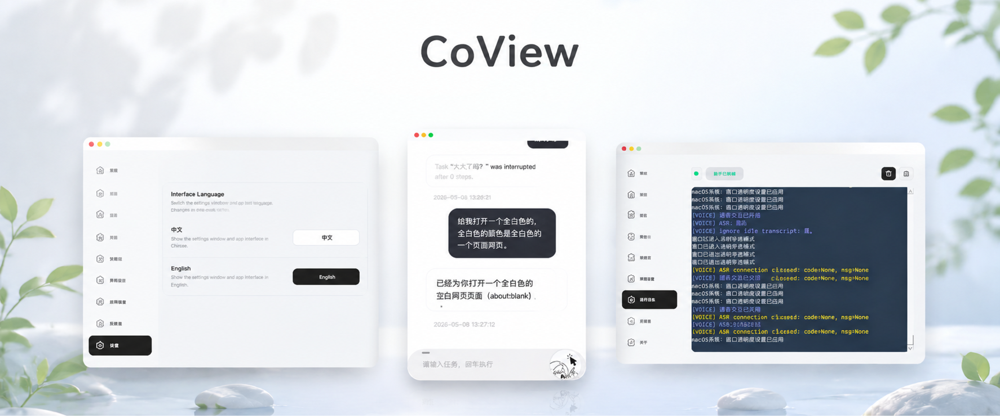
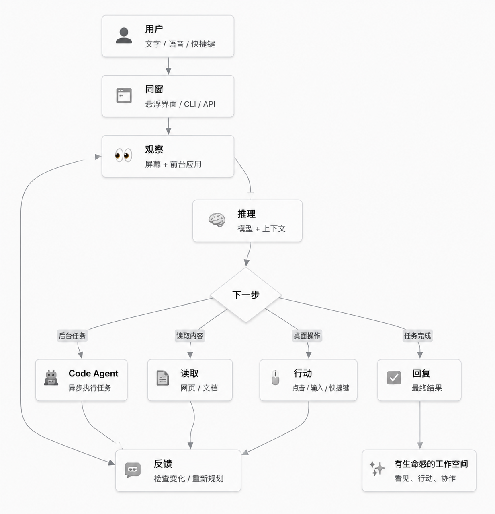
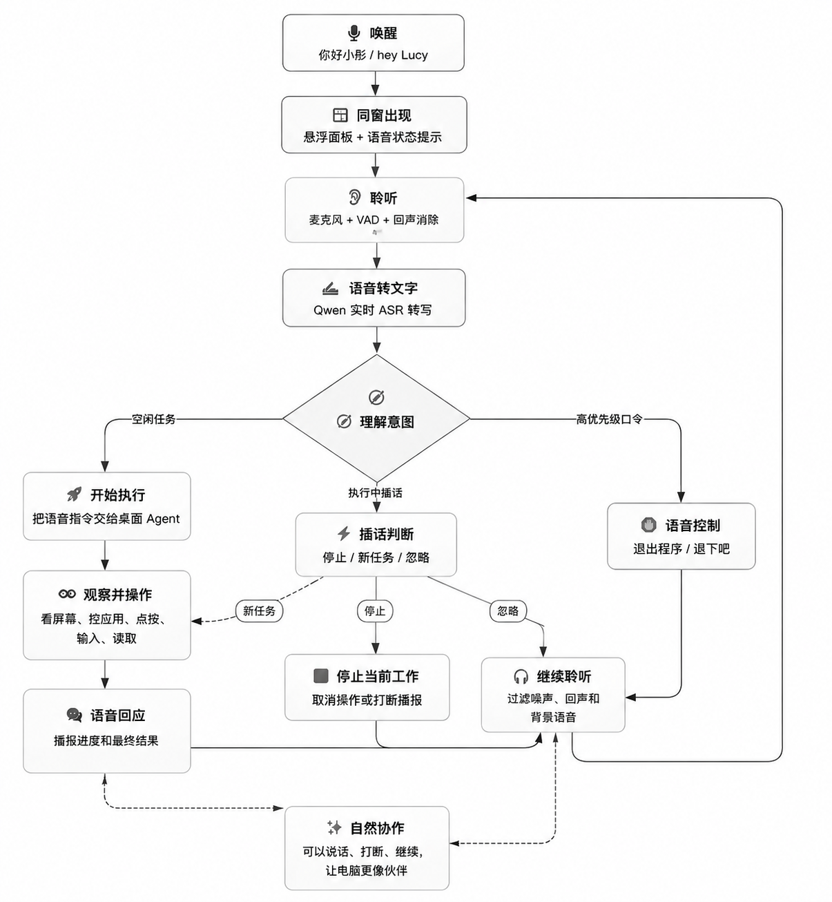

<h1 align="center">同窗 2.0 - 桌面 AI 伙伴</h1>

<p align="center">
  <a href="README.md">English README</a> ·
  <a href="docs/zh-CN/README.md">完整项目说明书</a>
</p>

<p align="center">
  
</p>

<p align="center">
  <a href="https://github.com/mini-yifan/CoView"></a>
  
  
  <a href="LICENSE"></a>
</p>

<p align="center">
  一个会看见、会行动、会与你协作的桌面 AI 伙伴，让电脑成为有生命感的工作空间。
</p>

---

## 为什么是同窗

同窗想做的是一件很直接的事：让电脑不再只是等待指令的工具。它应该能看见你正在看的内容，理解你想完成的任务，并和你一起在真实软件里推进工作。

同窗的核心是一个运行在本地的视觉控制循环：

```text
观察屏幕 -> 理解任务 -> 执行一步操作 -> 再次观察
```

所以它不是只能聊天的助手，而是能真正操作你正在使用的软件：浏览器、编辑器、文档、网页、桌面应用和代码工作区都可以成为它的协作现场。

## 核心能力

| 能力                   | 同窗可以做什么                                                                         |
| ---------------------- | -------------------------------------------------------------------------------------- |
| 👀 看见桌面            | 基于截图观察和视觉推理理解当前屏幕。                                                   |
| 🖥️ 多屏幕操作        | 理解并操作多个显示器上的窗口和内容并快速实现GUI操作。                                  |
| 🖱️ 操作电脑          | 点击、拖拽、滚动、快捷键、输入文本、读取网页或文档。                                   |
| 🤝 与人协作            | 通过悬浮助手提供任务输入、停止控制、运行日志、设置和伴随推荐。                         |
| 🎙️ 听见并回应        | 支持 ASR、TTS、本地唤醒词和语音状态提示。                                              |
| 🧑‍💻 后台 Code Agent | 在后台异步运行代码与自动化任务，支持codex、claude code、 kimi code等。                 |
| 🌐 中英文支持          | 提供中英文产品流程与说明文档。                                                         |
| 🔌 模型灵活            | 支持 OpenAI-compatible 模型接口，通过 `base_url`、`api_key`、`model_name` 配置。 |

## 同窗如何工作

<p align="center">
  
</p>

## 语音交互

<p align="center">
  
</p>

默认唤醒词：`你好小彤` 和 `hey Lucy`。

## 快速开始

环境要求：

- Python 3.10 或更新版本，推荐 Python 3.11/3.12。
- macOS 或 Windows。
- 一个兼容 OpenAI 风格接口的视觉模型服务。

### 1. 克隆仓库

| macOS / Linux                                          | Windows PowerShell                                     |
| ------------------------------------------------------ | ------------------------------------------------------ |
| `git clone https://github.com/mini-yifan/CoView.git` | `git clone https://github.com/mini-yifan/CoView.git` |
| `cd CoView`                                          | `cd CoView`                                          |

### 2. 创建并激活虚拟环境

| macOS / Linux                 | Windows PowerShell             |
| ----------------------------- | ------------------------------ |
| `python3 -m venv .venv`     | `py -3 -m venv .venv`        |
| `source .venv/bin/activate` | `.venv\Scripts\Activate.ps1` |

如果 PowerShell 阻止激活虚拟环境，可以在当前 PowerShell 窗口执行：

```powershell
Set-ExecutionPolicy -Scope Process -ExecutionPolicy Bypass
```

### 3. 安装项目

| macOS                                              | Windows                                 |
| -------------------------------------------------- | --------------------------------------- |
| `python3 -m pip install -U pip`                  | `py -m pip install -U pip`            |
| `python3 -m pip install -e ".[macos,voice,tts]"` | `py -m pip install -e ".[voice,tts]"` |

### 4. 配置模型

同窗默认读取仓库根目录的 `config.json`，并与 `src/baodou_ai/core/config.py` 里的默认配置合并。

```json
{
  "api_config": {
    "api_key": "YOUR_API_KEY",
    "base_url": "https://dashscope.aliyuncs.com/compatible-mode/v1",
    "model_name": "qwen3.6-35b-a3b"
  }
}
```

不要把真实 API Key 提交到公开仓库。

默认模型服务：

| 能力 | 默认服务 / 模型 | 说明 |
| --- | --- | --- |
| 视觉大模型 | 阿里云百炼 / `qwen3.6-35b-a3b` | 可以更改为其他兼容 OpenAI 接口、且支持视觉识别的大模型。 |
| 实时 ASR | 阿里云百炼 / `qwen3-asr-flash-realtime` | 目前暂不支持切换其他厂商。 |
| TTS 语音合成 | 阿里云百炼 / `cosyvoice-v3-flash` | 目前暂不支持切换其他厂商。 |

API Key 可在 [阿里云百炼](https://www.alibabacloud.com/help/zh/model-studio/get-api-key) 申请。默认视觉大模型、[ASR 语音识别](https://help.aliyun.com/zh/model-studio/asr-model/) 和 [TTS 语音合成](https://www.alibabacloud.com/help/zh/model-studio/text-to-speech) 使用的是同一个 DashScope API Key。后续会陆续增加其他厂商的 ASR 和 TTS 支持。

### 5. 启动

| 目标              | macOS                                             | Windows                                         |
| ----------------- | ------------------------------------------------- | ----------------------------------------------- |
| 启动悬浮 GUI      | `coview`                                        | `coview`                                      |
| 执行一个 CLI 任务 | `coview-cli "打开浏览器并搜索上海天气"`         | `coview-cli "打开记事本并输入 Hello"`         |
| 限制最大执行步数  | `coview-cli "总结当前页面" --max-iterations 20` | `coview-cli "打开计算器" --max-iterations 20` |
| 停止 CLI 任务     | `Ctrl+C`                                        | `Ctrl+C`                                      |

### 语音唤醒

如果需要免手动唤醒，先下载本地唤醒词模型：

| macOS / Linux                                  | Windows                                  |
| ---------------------------------------------- | ---------------------------------------- |
| `python3 scripts/download_wake_word_model.py` | `py scripts\download_wake_word_model.py` |

默认唤醒词是 `你好小彤` 和 `hey Lucy`。说 `退出程序` 可以通过语音退出同窗；英文支持 `exit program`、`quit app` 等 `close/exit/quit program/app` 类指令。

## 60 秒上手交互

1. 运行 `coview` 启动悬浮助手。
2. 打开设置窗口，填入模型 API Key、Base URL 和模型名称。
3. 点击悬浮输入框，输入任务，按 Enter 执行。
4. 观察同窗如何看屏幕、选择操作、执行一步、再次观察。
5. 如果任务偏离目标、范围过大或操作了错误窗口，点击停止按钮。

适合第一次尝试的任务：

```text
打开浏览器并搜索上海天气。
总结当前浏览器标签页中的文章。
打开计算器并计算 128 * 46。
读取当前可见文档，并列出待办事项。
创建一个后台 Code Agent 任务，分析这个仓库的测试结构。
```

## 项目说明书

| 文档              | 链接                                                                |
| ----------------- | ------------------------------------------------------------------- |
| 完整说明书索引    | [docs/zh-CN/README.md](docs/zh-CN/README.md)                           |
| 产品概览          | [docs/zh-CN/product-overview.md](docs/zh-CN/product-overview.md)       |
| 安装与配置        | [docs/zh-CN/setup-configuration.md](docs/zh-CN/setup-configuration.md) |
| 语音交互          | [docs/zh-CN/voice-interaction.md](docs/zh-CN/voice-interaction.md)     |
| CLI 与 Python API | [docs/zh-CN/usage-cli-api.md](docs/zh-CN/usage-cli-api.md)             |
| 架构说明          | [docs/zh-CN/architecture.md](docs/zh-CN/architecture.md)               |
| Agent 协议        | [docs/zh-CN/agent-protocol.md](docs/zh-CN/agent-protocol.md)           |
| 开发指南          | [docs/zh-CN/development.md](docs/zh-CN/development.md)                 |
| 安全与贡献        | [docs/zh-CN/safety-contributing.md](docs/zh-CN/safety-contributing.md) |

## 开源致谢

同窗基于许多优秀的开源项目构建，包括 [PyQt5](https://pypi.org/project/PyQt5/)、[OpenCV](https://opencv.org/)、[NumPy](https://numpy.org/)、[MSS](https://github.com/BoboTiG/python-mss)、[PyAutoGUI](https://github.com/asweigart/pyautogui)、[OpenAI Python SDK](https://github.com/openai/openai-python)、[tiktoken](https://github.com/openai/tiktoken)、[Pydantic](https://github.com/pydantic/pydantic)、[Pillow](https://python-pillow.org/)、[sherpa-onnx](https://github.com/k2-fsa/sherpa-onnx)、[SentencePiece](https://github.com/google/sentencepiece) 和 [sounddevice](https://github.com/spatialaudio/python-sounddevice)。

各项目的许可证与署名要求请以其上游仓库或发布页面为准。

## License

同窗基于 [MIT License](LICENSE) 开源。
