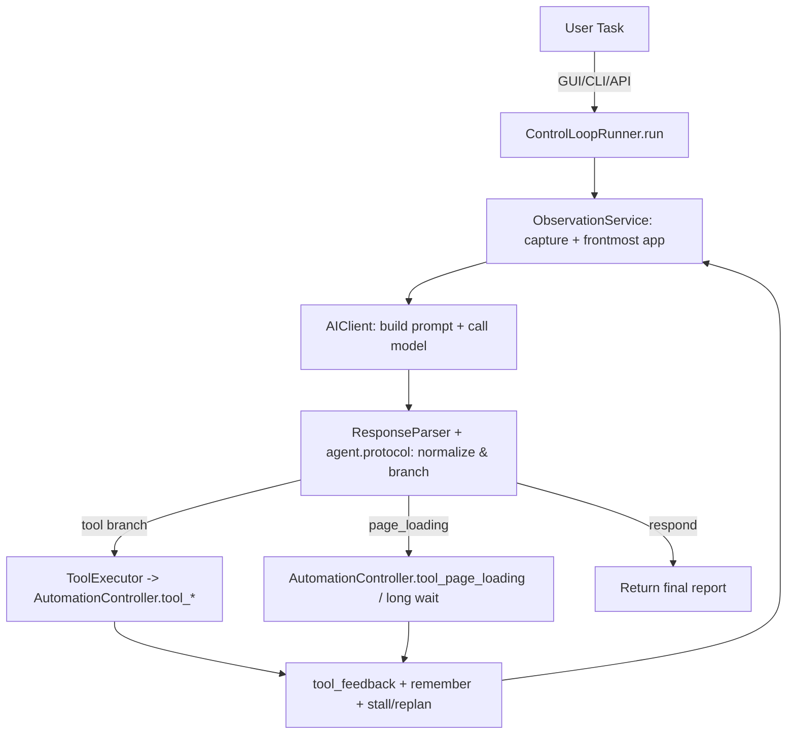
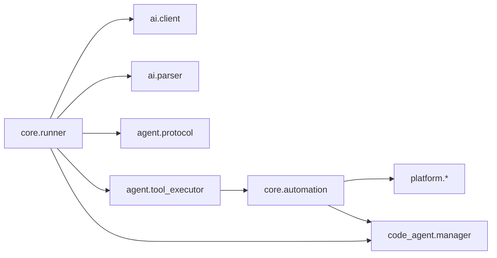

# Code Wiki — coview 2.0

本 Wiki 面向“读代码/二次开发”的需求，聚焦：整体架构、模块职责、关键类与函数、依赖关系、运行方式与扩展点。

## 1. 项目概览

同窗（coview）是一个“纯视觉 + 工具执行”的桌面自动化 Agent，支持 GUI / CLI / Python API 三种入口，统一由核心执行链 `ControlLoopRunner` 驱动（截图 → 模型决策 → 执行一个分支 → 再观察）。

- 仓库根目录：`CoView/`
- Python 包根：`src/baodou_ai/`
- 测试：`tests/`（pytest）

相关入口说明：
- GUI：入口在 [__main__.py](file:///Users/gaoyifan/Desktop/baodou/CoView/src/baodou_ai/__main__.py#L33-L55)
- CLI：入口在 [cli.py](file:///Users/gaoyifan/Desktop/baodou/CoView/src/baodou_ai/cli.py#L17-L136)
- Python API：入口在 [api.py](file:///Users/gaoyifan/Desktop/baodou/CoView/src/baodou_ai/api.py#L14-L124)

## 2. 快速运行

### 2.1 安装

参考 [README.md](file:///Users/gaoyifan/Desktop/baodou/CoView/README.md#L39-L101)：

```bash
python -m venv .venv
source .venv/bin/activate
pip install -e .
pip install -e ".[dev]"
```

### 2.2 启动入口

```bash
# GUI（推荐）
coview
# 或 console script
coview

# CLI
coview-cli "打开浏览器" --api-key YOUR_KEY
```

### 2.3 Python API

```python
from baodou_ai import CoViewAI

ai = CoViewAI(api_key="YOUR_KEY")
result = ai.execute("打开浏览器并搜索今日天气")
print(result)
```

## 3. 仓库结构

仓库的主要目录（以“职责”视角）：

```text
CoView/
├── src/baodou_ai/               # 主代码：GUI/CLI/API + 核心执行链 + 平台/语音/TTS/后台 CodeAgent
├── tests/                       # pytest
├── docs/                        # 架构/接入/治理/验收文档
├── scripts/                     # GUI 验收入口、手工辅助脚本
└── examples/                    # API 示例
```

源码包结构（按子系统分层）：

- `baodou_ai.agent/`：Agent 协议、工具 schema、工具参数归一化、工具执行分发
- `baodou_ai.ai/`：模型调用、prompt 组装、解析、记忆与会话历史
- `baodou_ai.core/`：核心运行时（Runner、Automation、Screenshot、Stall/Report 策略、运行态产物存储等）
- `baodou_ai.gui/`：PyQt5 悬浮球 UI、控制台、日志、任务生命周期控制
- `baodou_ai.platform/`：macOS/Windows 平台适配（资源路径、透明模式、屏幕/鼠标、热键等）
- `baodou_ai.code_agent/`：后台代码任务（provider adapter、任务管理、报告生成、会话文件）
- `baodou_ai.voice/`：语音交互（ASR/VAD/本地语音唤醒/意图分类）
- `baodou_ai.tts/`：TTS 播报

## 4. 总体架构

### 4.1 分层与职责

项目核心是一条统一的“控制循环”（Control Loop），由 `ControlLoopRunner` 组织；GUI/CLI/API 只负责把用户输入转成 runner 能执行的参数与回调（以及 UI/线程等）。当前轮次级分支执行已经从主循环中下沉到 `core/runner_turns.py`。

建议将架构理解为 6 层（上层依赖下层）：

1) 入口层：GUI/CLI/API  
2) 控制循环层：`ControlLoopRunner`（任务状态、循环策略、停滞保护、上下文管理）  
3) 模型交互层：`AIClient` + `PromptBuilder` + `MemoryManager`  
4) 协议与工具层：`ResponseParser` + `agent.protocol` + `ToolExecutor` + `tool_registry`  
5) 自动化执行层：`AutomationController`（Desktop/File/Page/Document/Runtime/Background mixins）  
6) 平台/外设层：`platform`（多屏、DPI、鼠标移动、透明穿透、热键等）与系统依赖（PyQt5/pyautogui/mss/opencv…）

### 4.2 关键数据流（主循环）

`ControlLoopRunner.run()` 是系统“统一内核”，核心流程（概念图）：



实现证据（建议从这里开始读代码）：
- `ControlLoopRunner.__init__` 装配核心组件：`src/baodou_ai/core/runner.py`
- `ControlLoopRunner.run` 主循环：`src/baodou_ai/core/runner.py`
- 分支处理（tool/page_loading/respond）：`src/baodou_ai/core/runner_turns.py`

### 4.3 “扁平分支协议”（Agent 协议 2.0）

模型输出为 JSON 对象，顶层必须且只能有一个“分支键”：

- 工具分支：分支键为工具名（如 `click`、`input_text`、`open_in_browser` 等）
- 或 `page_loading`
- 或 `respond`

协议归一化与分支识别：
- 分支选择：[get_agent_response_branch](file:///Users/gaoyifan/Desktop/baodou/CoView/src/baodou_ai/agent/protocol.py#L42-L47)
- 工具分支判断：[is_tool_branch](file:///Users/gaoyifan/Desktop/baodou/CoView/src/baodou_ai/agent/protocol.py#L49-L51)
- 完整归一化入口：[normalize_agent_response](file:///Users/gaoyifan/Desktop/baodou/CoView/src/baodou_ai/agent/protocol.py#L53-L92)

### 4.4 停滞检测与重规划

Runner 通过“屏幕哈希 + 动作签名”检测循环停滞，并触发 replan 或判定任务困难：
- 停滞与困难阈值来自配置：`execution_config.stalled_replan_threshold` / `stalled_difficult_threshold`
- tool 分支重规划与困难退出逻辑：`src/baodou_ai/core/runner_turns.py`
- page_loading 分支同样有 replan / difficult：`src/baodou_ai/core/runner_turns.py`

## 5. 核心模块职责与依赖

### 5.1 baodou_ai（包入口与公共 API）

- `__main__.py`：GUI 启动，创建 `QApplication` + `Config` + `FloatingController`：[__main__.py](file:///Users/gaoyifan/Desktop/baodou/CoView/src/baodou_ai/__main__.py#L33-L55)
- `cli.py`：命令行解析后调用 `CoViewAI.execute()`：[cli.py](file:///Users/gaoyifan/Desktop/baodou/CoView/src/baodou_ai/cli.py#L17-L113)
- `api.py`：对外 `CoViewAI` 类与 `execute_task` 便捷函数：[api.py](file:///Users/gaoyifan/Desktop/baodou/CoView/src/baodou_ai/api.py#L14-L124)
- `__init__.py`：对外导出列表（Config / ScreenshotCapture / AutomationController / AIClient / CoViewAI…）：[__init__.py](file:///Users/gaoyifan/Desktop/baodou/CoView/src/baodou_ai/__init__.py#L7-L27)

### 5.2 baodou_ai.core（控制循环与自动化执行内核）

核心目标：把“模型输出的一个分支”可靠地变成一次“可观测的桌面变化”，并把结果反馈给下一轮模型。

- `ControlLoopRunner`：主循环与调度中心：`src/baodou_ai/core/runner.py`
  - 生成 user_content：`build_user_content()`
  - 统一执行入口：`run()`
- `RunnerBranchExecutor`：轮次级分支执行协调：`src/baodou_ai/core/runner_turns.py`
- `AutomationController`：工具实现的宿主，通过 mixin 组合能力：[automation.py](file:///Users/gaoyifan/Desktop/baodou/CoView/src/baodou_ai/core/automation.py#L49-L79)
- `ScreenshotCapture`：截图与多屏打包（含 `ScreenCaptureBundle`）：[screenshot.py](file:///Users/gaoyifan/Desktop/baodou/CoView/src/baodou_ai/core/screenshot.py#L36-L52) 与 [ScreenshotCapture](file:///Users/gaoyifan/Desktop/baodou/CoView/src/baodou_ai/core/screenshot.py#L86-L206)
- `Config`：配置加载与默认值合并、平台路径解析：[config.py](file:///Users/gaoyifan/Desktop/baodou/CoView/src/baodou_ai/core/config.py#L204-L306)

依赖方向（简化）：



### 5.3 baodou_ai.ai（模型交互、prompt、解析与记忆）

- `AIClient`：OpenAI SDK 客户端包装（base_url/api_key/tls_verify）、prompt 加载（按平台选择）、请求模型与流式输出等：[AIClient](file:///Users/gaoyifan/Desktop/baodou/CoView/src/baodou_ai/ai/client.py#L40-L179)
  - prompt 文件选择与注入工具定义：[AIClient._load_prompt](file:///Users/gaoyifan/Desktop/baodou/CoView/src/baodou_ai/ai/client.py#L143-L179)
  - 组装当轮 user 内容（由 PromptBuilder 拼装运行态上下文）：[AIClient._build_full_user_content](file:///Users/gaoyifan/Desktop/baodou/CoView/src/baodou_ai/ai/client.py#L212-L253)
- `ResponseParser`：对模型输出进行多种容错解析，并最终走 `normalize_agent_response`：[ResponseParser.parse](file:///Users/gaoyifan/Desktop/baodou/CoView/src/baodou_ai/ai/parser.py#L50-L129)

### 5.4 baodou_ai.agent（协议与工具体系）

- 协议归一化（强约束：顶层一个分支键）：[protocol.py](file:///Users/gaoyifan/Desktop/baodou/CoView/src/baodou_ai/agent/protocol.py#L1-L93)
- 工具定义与 schema：`TOOL_DEFINITIONS` + `normalize_tool_args` + `render_tool_prompt`（供 prompt 注入）：[tool_registry.py](file:///Users/gaoyifan/Desktop/baodou/CoView/src/baodou_ai/agent/tool_registry.py#L835-L865)
- 工具执行器：将 `tool_name` 映射到 `AutomationController.tool_{tool}`，并统一封装异常为 `error_envelope`：[ToolExecutor.execute](file:///Users/gaoyifan/Desktop/baodou/CoView/src/baodou_ai/agent/tool_executor.py#L20-L70)

### 5.5 baodou_ai.code_agent（后台代码任务系统）

这个子系统用于把“可离线生成的交付物/代码任务”放到后台跑（多 provider 可选），并把结果汇报注入到主 Agent 上下文中。

- `JobManager`：submit/list/get/cancel/dismiss，以及“运行中任务卡片 prompt / 待汇报 prompt”的构建：[JobManager](file:///Users/gaoyifan/Desktop/baodou/CoView/src/baodou_ai/code_agent/manager.py#L35-L166) 与 [build_running_jobs_prompt](file:///Users/gaoyifan/Desktop/baodou/CoView/src/baodou_ai/code_agent/manager.py#L243-L258)
- `CodeAgentDispatcher`：根据 `code_agent_config.provider` 选择 adapter 并运行：[dispatcher.py](file:///Users/gaoyifan/Desktop/baodou/CoView/src/baodou_ai/code_agent/dispatcher.py#L20-L67)

### 5.6 baodou_ai.platform（跨平台适配）

目标：把“平台差异”从 GUI/Automation 中隔离出来，统一抽象为 `PlatformAdapter` 接口。

- `get_platform_adapter()`：根据 `platform.system()` 选择 MacOS/Windows adapter：[platform/__init__.py](file:///Users/gaoyifan/Desktop/baodou/CoView/src/baodou_ai/platform/__init__.py#L10-L27)
- `PlatformAdapter` 抽象接口（资源路径、透明模式、DPI、多屏、鼠标等）：[PlatformAdapter](file:///Users/gaoyifan/Desktop/baodou/CoView/src/baodou_ai/platform/base.py#L15-L240)

### 5.7 baodou_ai.gui（悬浮球与任务生命周期）

- `FloatingController`：GUI 总控（窗口装配、热键、协作者注入、主线程入口收口）：`src/baodou_ai/gui/floating/controller.py`
- `TaskSessionController`：任务生命周期（启动/停止/worker 信号/历史与内存收尾）：`src/baodou_ai/gui/floating/task_session_controller.py`
- `FloatingTaskSessionHost`：GUI 主控与任务会话桥接层：`src/baodou_ai/gui/floating/task_session_host.py`
- `FloatingBackgroundActivityCoordinator`：前台观察与后台轮询节奏协调：`src/baodou_ai/gui/floating/background_activity_coordinator.py`
- `FloatingVoiceRuntimeCoordinator` / 其他 GUI 委托：`src/baodou_ai/gui/floating/controller_delegates.py`
- `CompanionController`：伴随推荐状态机：`src/baodou_ai/gui/floating/companion_controller.py`
- `CaptureRecommendWorker`：伴随推荐截图与推荐计算 worker：`src/baodou_ai/gui/floating/companion_capture_worker.py`

### 5.8 baodou_ai.voice / baodou_ai.tts（语音交互、本地唤醒与播报）

- `VoiceIntentClassifier`：把语音转写分类为 stop/new_task/ignore（尽量不触碰 agent memory）：[intent_classifier.py](file:///Users/gaoyifan/Desktop/baodou/CoView/src/baodou_ai/voice/intent_classifier.py#L25-L109)
- `SherpaKeywordSpotter`：封装 `sherpa-onnx` 关键词唤醒模型加载、关键词生成与命中提取：[sherpa_keyword_spotter.py](file:///Users/gaoyifan/Desktop/baodou/CoView/src/baodou_ai/voice/sherpa_keyword_spotter.py)
- `WakeWordEngine`：管理待唤醒、命中、冷却、降级等状态，以及音频监听生命周期：[wake_word_engine.py](file:///Users/gaoyifan/Desktop/baodou/CoView/src/baodou_ai/voice/wake_word_engine.py)
- `CosyVoiceTTS`：DashScope + sounddevice 的流式播报（带错误封装）：[CosyVoiceTTS](file:///Users/gaoyifan/Desktop/baodou/CoView/src/baodou_ai/tts/cosyvoice.py#L68-L173)

### 5.9 本地语音唤醒链路

本地语音唤醒在当前项目中的设计是“轻监听 + 现有语音链路复用”：

- 未固定状态下，`FloatingController` 启动 `WakeWordEngine`
- `WakeWordEngine` 使用 `SherpaKeywordSpotter` 驱动 `sherpa-onnx` 本地关键词唤醒
- 唤醒词命中后，GUI 激活悬浮球并切换到现有 `VoiceInteractionController`
- 命中后立即用 TTS 播报“我在”，给用户声音反馈
- 完整语音交互期间暂停 wake-word 监听，结束后恢复

相关入口：

- GUI 总控切换逻辑：[controller.py](file:///Users/gaoyifan/Desktop/baodou/CoView/src/baodou_ai/gui/floating/controller.py)
- 唤醒模型封装：[sherpa_keyword_spotter.py](file:///Users/gaoyifan/Desktop/baodou/CoView/src/baodou_ai/voice/sherpa_keyword_spotter.py)
- 唤醒引擎状态机：[wake_word_engine.py](file:///Users/gaoyifan/Desktop/baodou/CoView/src/baodou_ai/voice/wake_word_engine.py)

## 6. 关键类与函数索引（导航用）

### 6.1 入口与对外 API

- GUI 启动函数：`baodou_ai.__main__.main()`：[__main__.py](file:///Users/gaoyifan/Desktop/baodou/CoView/src/baodou_ai/__main__.py#L33-L55)
- CLI 启动函数：`baodou_ai.cli.main()`：[cli.py](file:///Users/gaoyifan/Desktop/baodou/CoView/src/baodou_ai/cli.py#L17-L136)
- 对外控制器：`CoViewAI.execute()`：[api.py](file:///Users/gaoyifan/Desktop/baodou/CoView/src/baodou_ai/api.py#L14-L98)

### 6.2 控制循环与运行态

- 核心执行：`ControlLoopRunner.run()`：`src/baodou_ai/core/runner.py`
- 分支处理（tool/page_loading/respond）：`src/baodou_ai/core/runner_turns.py`

### 6.3 协议/解析/工具

- 协议归一化：`normalize_agent_response()`：[protocol.py](file:///Users/gaoyifan/Desktop/baodou/CoView/src/baodou_ai/agent/protocol.py#L53-L92)
- 模型输出解析：`ResponseParser.parse()`：[parser.py](file:///Users/gaoyifan/Desktop/baodou/CoView/src/baodou_ai/ai/parser.py#L50-L129)
- 工具执行分发：`ToolExecutor.execute()`：[tool_executor.py](file:///Users/gaoyifan/Desktop/baodou/CoView/src/baodou_ai/agent/tool_executor.py#L20-L70)
- 工具 prompt 注入：`render_tool_prompt()`：[tool_registry.py](file:///Users/gaoyifan/Desktop/baodou/CoView/src/baodou_ai/agent/tool_registry.py#L857-L865)

### 6.4 配置与路径

- 默认配置：`DEFAULT_CONFIG`：[config.py](file:///Users/gaoyifan/Desktop/baodou/CoView/src/baodou_ai/core/config.py#L16-L201)
- 配置加载与合并：`Config.load()`：[config.py](file:///Users/gaoyifan/Desktop/baodou/CoView/src/baodou_ai/core/config.py#L267-L281)
- 运行时路径：`resolve_memory_file()` / `resolve_context_debug_dir()`：[runtime_paths.py](file:///Users/gaoyifan/Desktop/baodou/CoView/src/baodou_ai/runtime_paths.py#L12-L19)

本地语音唤醒相关配置：

- `wake_word_config.enabled`：是否启用本地语音唤醒
- `wake_word_config.phrases`：默认唤醒词为 `你好彤彤` 与 `hello Lulu`
- `wake_word_config.model_dir`：默认模型目录为 `models/sherpa-onnx-kws-zipformer-zh-en-3M-2025-12-20`
- `Config.resolve_resource_path()`：将相对资源路径解析为运行时绝对路径，供本地模型目录和关键词文件使用

## 7. 依赖与可选能力

依赖来自 [pyproject.toml](file:///Users/gaoyifan/Desktop/baodou/CoView/pyproject.toml#L40-L82)：

- 核心依赖：PyQt5、opencv-python、numpy、mss、pyautogui、pyperclip、openai、tiktoken、pydantic、Pillow、dashscope、sounddevice 等
- 本地语音唤醒依赖：`sherpa-onnx`、`sentencepiece`
- 可选依赖：
  - `.[dev]`：pytest/black/flake8/mypy
  - `.[macos]`：pyobjc（macOS 全局热键/原生能力）
  - `.[tts]` / `.[voice]`：语音相关依赖
  - `.[build]`：pyinstaller

## 8. 测试、脚本与示例

- 测试框架：pytest（配置见 [pyproject.toml](file:///Users/gaoyifan/Desktop/baodou/CoView/pyproject.toml#L127-L130)）
- GUI 验收入口脚本：`scripts/run_gui_acceptance.py`（用于集中跑 GUI/平台测试）
- 本地唤醒模型下载脚本：`scripts/download_wake_word_model.py`
- API 示例：`examples/api_example.py`

本地唤醒模型准备：

- 默认模型名：`sherpa-onnx-kws-zipformer-zh-en-3M-2025-12-20`
- 默认放置目录：`models/sherpa-onnx-kws-zipformer-zh-en-3M-2025-12-20`
- 推荐使用下载脚本自动准备模型，而不是把模型目录纳入普通 Git 提交

## 9. 扩展点（面向二次开发）

### 9.1 新增 GUI 工具（供模型调用）

基本思路：新增一个 `tool_xxx` 方法 + 在工具注册处加入定义与参数 schema 归一化。

- 工具执行分发依赖命名约定：`ToolExecutor` 会调用 `AutomationController.tool_{tool_name}`：[tool_executor.py](file:///Users/gaoyifan/Desktop/baodou/CoView/src/baodou_ai/agent/tool_executor.py#L33-L46)
- 工具 prompt 注入来源：`render_tool_prompt()`：[tool_registry.py](file:///Users/gaoyifan/Desktop/baodou/CoView/src/baodou_ai/agent/tool_registry.py#L857-L865)

### 9.2 新增后台 CodeAgent provider

- 在 `CodeAgentDispatcher` 的 `_adapters` 增加 provider key → adapter 实例：[dispatcher.py](file:///Users/gaoyifan/Desktop/baodou/CoView/src/baodou_ai/code_agent/dispatcher.py#L29-L35)
- 在 `DEFAULT_CONFIG.code_agent_config.providers` 增加 provider 的命令与参数模板：[config.py](file:///Users/gaoyifan/Desktop/baodou/CoView/src/baodou_ai/core/config.py#L67-L129)

### 9.3 新增平台适配

- 实现 `PlatformAdapter` 抽象接口：[base.py](file:///Users/gaoyifan/Desktop/baodou/CoView/src/baodou_ai/platform/base.py#L15-L240)
- 在 `platform/__init__.py` 的 `_get_adapter_class` 分发新平台：[platform/__init__.py](file:///Users/gaoyifan/Desktop/baodou/CoView/src/baodou_ai/platform/__init__.py#L10-L19)
