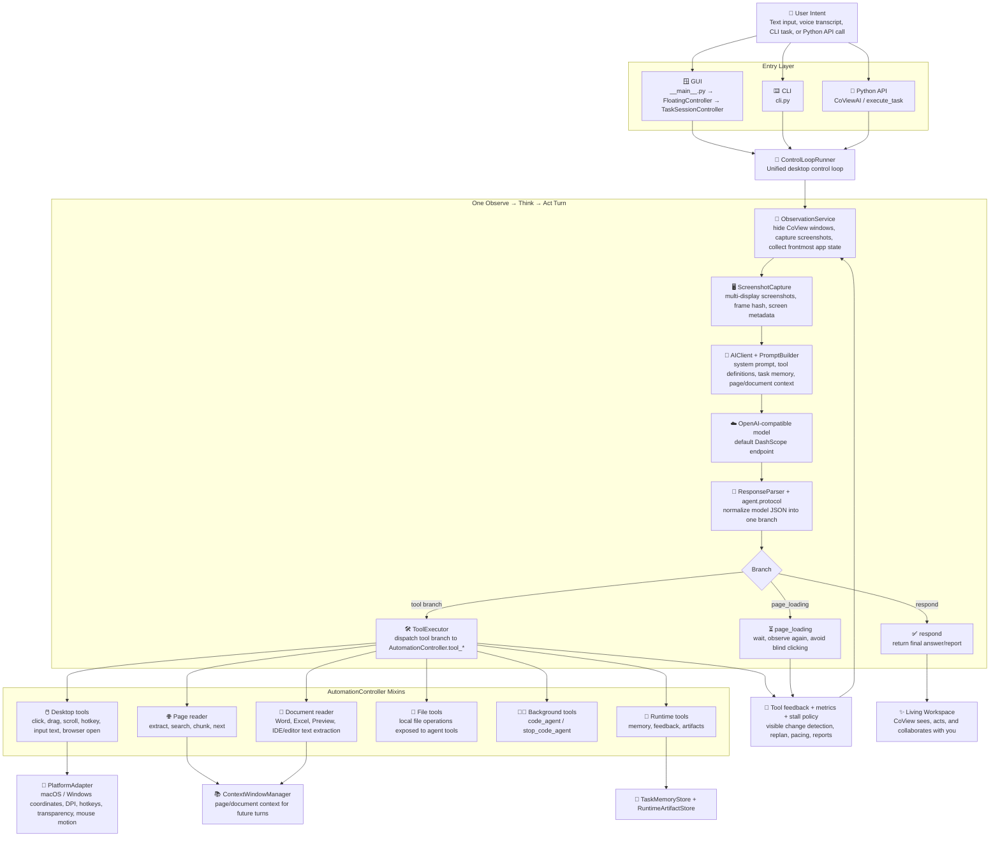
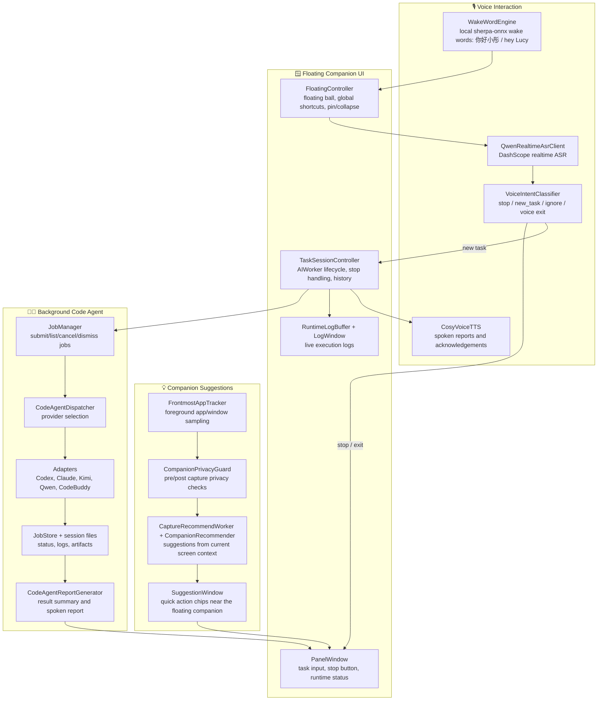
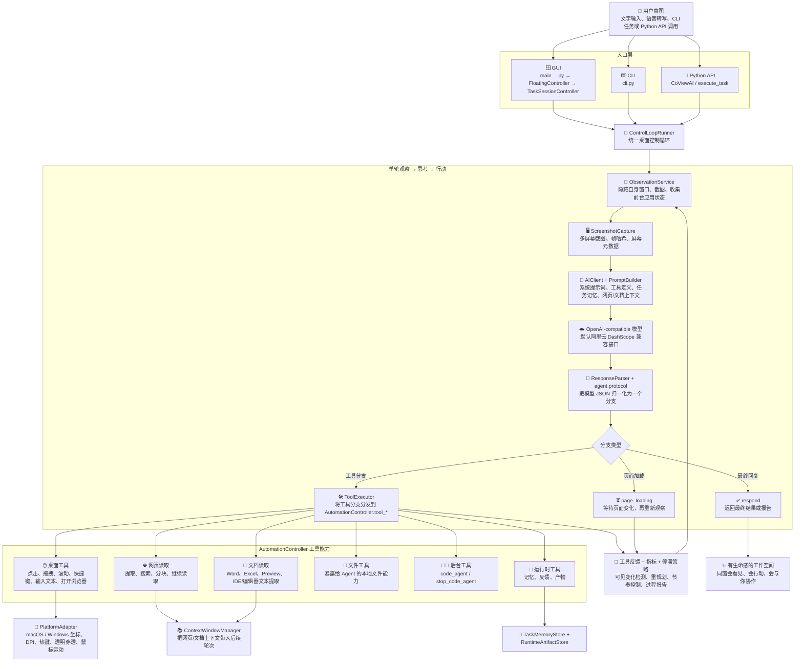

# CoView Architecture Flow

This flow is aligned with the current code structure. It is meant for README promotion, but the boxes map to real modules in `src/baodou_ai`.

## Runtime Flow

## Feature Side Flows

## 中文版

