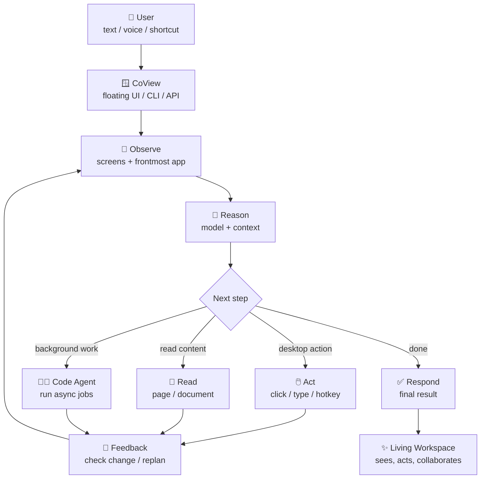
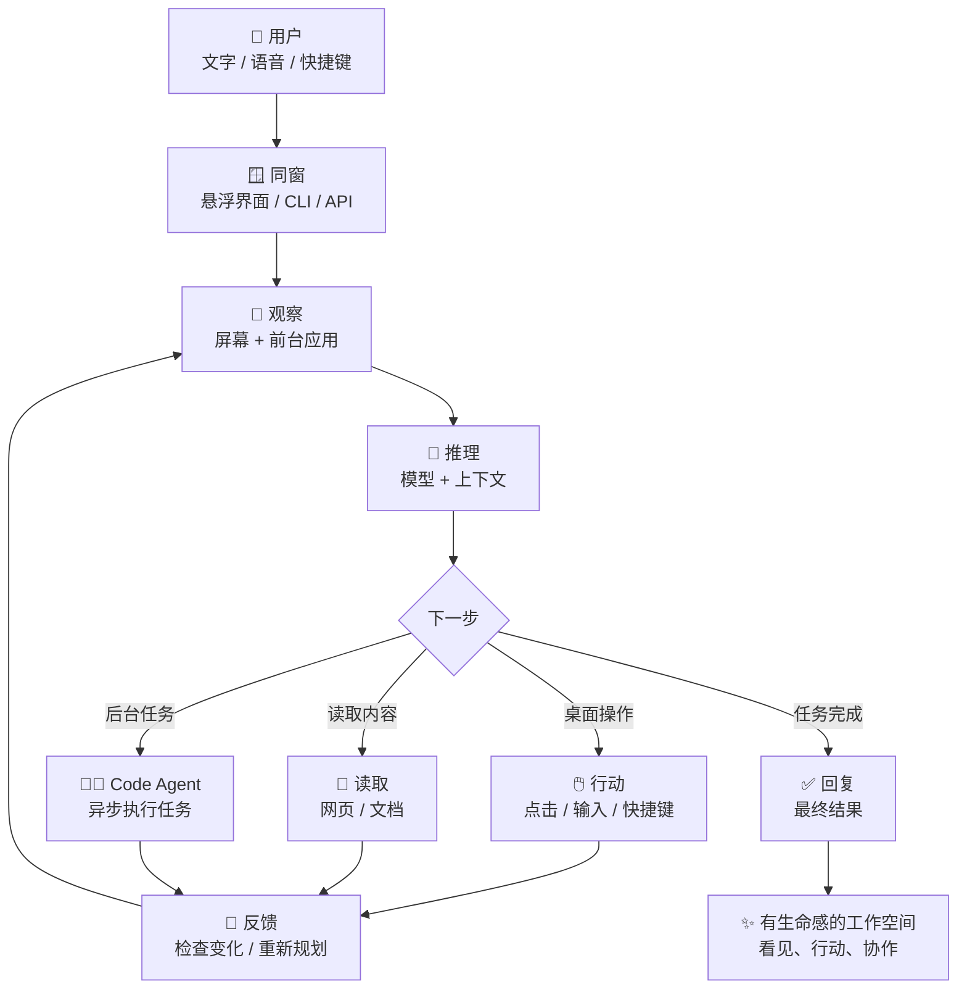

# CoView Simple Flow

This is the simplified version for README promotion. It keeps the real runtime shape while reducing node count and text.

```mermaid
flowchart TD
    A["👤 User<br/>text / voice / shortcut"] --> B["🪟 CoView<br/>floating UI / CLI / API"]
    B --> C["👀 Observe<br/>screens + frontmost app"]
    C --> D["🧠 Reason<br/>model + context"]
    D --> E{"Next step"}

    E -->|desktop action| F["🖱️ Act<br/>click / type / hotkey"]
    E -->|read content| G["📄 Read<br/>page / document"]
    E -->|background work| H["🧑‍💻 Code Agent<br/>run async jobs"]
    E -->|done| I["✅ Respond<br/>final result"]

    F --> J["🔁 Feedback<br/>check change / replan"]
    G --> J
    H --> J
    J --> C

    I --> K["✨ Living Workspace<br/>sees, acts, collaborates"]
```

## 中文版

```mermaid
flowchart TD
    A["👤 用户<br/>文字 / 语音 / 快捷键"] --> B["🪟 同窗<br/>悬浮界面 / CLI / API"]
    B --> C["👀 观察<br/>屏幕 + 前台应用"]
    C --> D["🧠 推理<br/>模型 + 上下文"]
    D --> E{"下一步"}

    E -->|桌面操作| F["🖱️ 行动<br/>点击 / 输入 / 快捷键"]
    E -->|读取内容| G["📄 读取<br/>网页 / 文档"]
    E -->|后台任务| H["🧑‍💻 Code Agent<br/>异步执行任务"]
    E -->|任务完成| I["✅ 回复<br/>最终结果"]

    F --> J["🔁 反馈<br/>检查变化 / 重新规划"]
    G --> J
    H --> J
    J --> C

    I --> K["✨ 有生命感的工作空间<br/>看见、行动、协作"]
```
