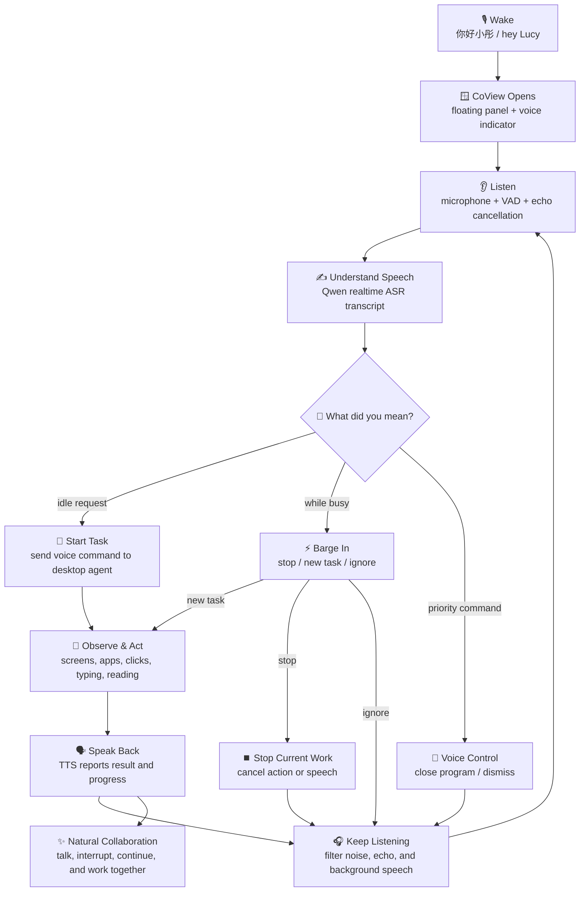
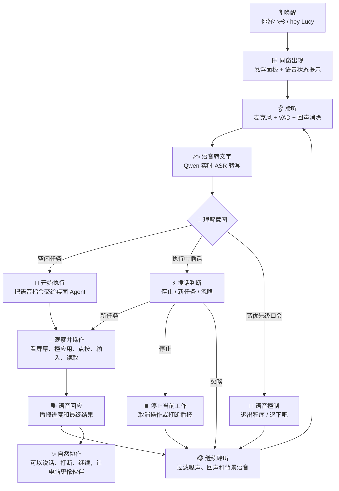

# CoView Voice Interaction Flow

This is a README-ready promotional flow for CoView's voice interaction. It keeps the diagram simple while reflecting the real runtime path: local wake word, realtime ASR, intent handling, desktop action, and spoken feedback.

## 中文版

这版更适合直接放进中文 README，用来宣传同窗的语音交互机制：先用本地唤醒词叫醒，再通过实时语音识别理解任务，随后进入桌面智能体的观察和操作循环，最后用语音播报结果；执行中还能随时插话、停止或切换任务。

## README Copy

CoView's voice mode is designed for natural desktop collaboration. You can wake it with `你好小彤` or `hey Lucy`, speak a task, interrupt while it is working, stop speech or actions, and let it respond through TTS after the desktop agent finishes each step.
